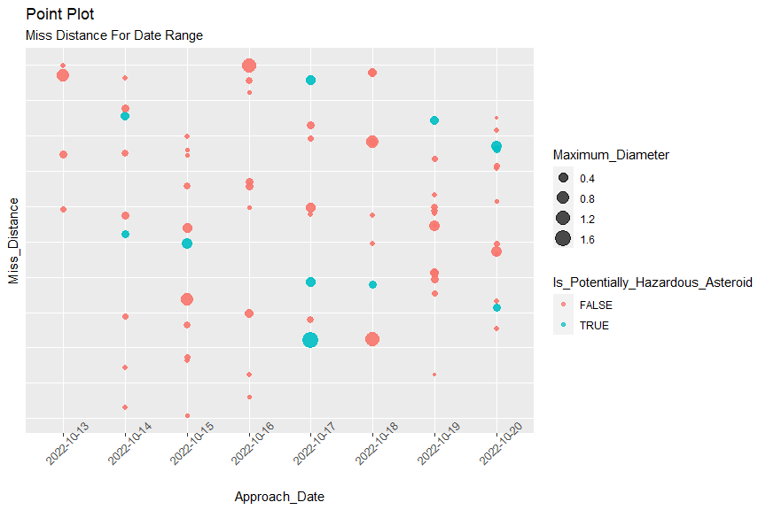

ST558 Project 2
================
Shyam Gadhwala & Kamlesh Pandey

``` r
library(httr)
library(tidyverse)
library(jsonlite)
library(dplyr)
library(lubridate)
```

# Asteroid - NeoWs API

NeoWs (Near Earth object Web Service) is a REST API for near earth
Asteroid information. Near Earth Objects (NEOs) are comets and asteroids
and due to the gravitational attraction of narby planet they enter into
earth gravitational orbit

This API has near earth objects (NEO) tracking and the dataset has 99%
asteroids and only 1% comet data.

Parameter information:

Magnitude (H): Asteroid absolute magnitude (in general, smaller H
implies larger asteroid diameter). This parameter is undefined for
comets.

Close-Approach (CA) Date : Date (TBD) of closest Earth approach.

V Relative : Object velocity relative to the earth

``` r
asteroidData <- function(start_date, end_date, ...){
  baseURL <- 'https://api.nasa.gov/neo/rest/v1/'
  apiKey <- 'igUogzKaubKUi5TTgsbYcdVgU8pICrvizcCrCtY5'
  endpoint <- 'feed'
  url <- paste0(baseURL, endpoint, '?startDate=', start_date, '&endDate=', end_date,'&api_key=', apiKey)
  
  res <- GET(url)
  asteroidData <- fromJSON(rawToChar(res$content))
  
  # check for date format
  dateFormat <- "%Y-%m-%d"
  
  checkStart <- tryCatch(!is.na(as.Date(start_date, dateFormat)), 
             error = function(err) 
             {TRUE})
  
  checkEnd <- tryCatch(!is.na(as.Date(end_date, dateFormat)), 
             error = function(err) 
             {TRUE})
  
  # First Check for date format
  if (checkStart == FALSE | checkEnd == FALSE){
    message <- paste('[ERROR..!!] Either your start or end date is not is correct YYYY-MM-DD format')
    print(message)
    stop(message)
  }
  else if(checkStart == TRUE & checkEnd == TRUE){
    #check if end_date > start_date
    if (ymd(end_date) < ymd(start_date)){
      message <- paste('End date' , end_date, 'should be greater than the start date', start_date)
      print(message)
      stop(message())
      
      } else if (ymd(end_date) > ymd(start_date)){
        
        # check for the diff between the start and end date
        diffDate <- difftime(ymd(end_date), ymd(start_date), units = 'days')
        
        if (diffDate > 8){
          message <- paste('[WARNING..!!] The difference between the date range should be less than 8 days', 
                           'for this current date range the API will return future Approach date ')
          print(message)
        }
        
  # API Parameters      
        magnitude <- c()
        dMin  <- c()
        dMax <- c()
        velocity <- c()
        Date <- c()
        missDist <- c()
        orbitBody <- c()
        isHazard <- c()
          
        for (i in 1:length(asteroidData$near_earth_objects)) {
          absMag <- asteroidData$near_earth_objects[[i]]$absolute_magnitude_h
          dMin_  <- asteroidData$near_earth_objects[[i]]$estimated_diameter$miles$estimated_diameter_min
          dMax_ <- asteroidData$near_earth_objects[[i]]$estimated_diameter$miles$estimated_diameter_max
          isHazard_ <- asteroidData$near_earth_objects[[i]]$is_potentially_hazardous_asteroid
          
          tempDate <- c()
          tempVel <- c()
          tempDist <- c()
          tempOrbit <- c()
          
          # for close approach
          for (j in 1:length(asteroidData$near_earth_objects[[i]]$close_approach_data)){
            vel <- asteroidData$near_earth_objects[[i]]$close_approach_data[[j]]$relative_velocity$kilometers_per_hour
            tempVel <- append(tempVel, vel)
            date <- asteroidData$near_earth_objects[[i]]$close_approach_data[[j]]$close_approach_date
            tempDate <- append(tempDate, date)
            dist <- asteroidData$near_earth_objects[[i]]$close_approach_data[[j]]$miss_distance$astronomical
            tempDist <- append(tempDist, dist)
            orbit <- asteroidData$near_earth_objects[[i]]$close_approach_data[[j]]$orbiting_body
            tempOrbit <- append(tempOrbit, orbit)
            
          }
          
          missDist <- append(missDist, tempDist)
          Date <- append(Date, tempDate)
          velocity <-append(velocity, tempVel)
          magnitude <- append(magnitude, absMag)
          dMin <- append(dMin, dMin_)
          dMax <- append(dMax, dMax_)
          orbitBody <- append(orbitBody, tempOrbit)
          isHazard <- append(isHazard, isHazard_)
          
  }
  
      }
  }
  aesData <- tibble('Magnitude' = magnitude, 
                    'Minimum_Diameter' = dMin, 
                    'Maximum_Diameter' = dMax, 
                    'Relative_Velocity' = velocity,
                    'Approach_Date' = Date, 
                    'Miss_Distance' = missDist,
                    'Orbiting_Body' = orbitBody,
                    'Is_Potentially_Hazardous_Asteroid' = isHazard)
  
return (list(url = url, data = aesData))
  
}

data <- asteroidData('1994-10-10', '1994-12-10')$data
```

    ## [1] "[WARNING..!!] The difference between the date range should be less than 8 days for this current date range the API will return future Approach date "

``` r
# EDA on Asteroid data

asteroidData <- data

asteroidData
```

    ## # A tibble: 71 x 8
    ##    Magnitude Minimum_Diameter
    ##        <dbl>            <dbl>
    ##  1      20.6           0.125 
    ##  2      22.1           0.0628
    ##  3      21.1           0.0995
    ##  4      24.5           0.0208
    ##  5      21             0.104 
    ##  6      21.2           0.0950
    ##  7      24.2           0.0234
    ##  8      23             0.0415
    ##  9      25.2           0.0148
    ## 10      19.6           0.199 
    ## # ... with 61 more rows, and
    ## #   6 more variables:
    ## #   Maximum_Diameter <dbl>,
    ## #   Relative_Velocity <chr>,
    ## #   Approach_Date <chr>,
    ## #   Miss_Distance <chr>,
    ## #   Orbiting_Body <chr>, ...

``` r
# First round up to two values 


plot1 <- ggplot(asteroidData, aes(x = Approach_Date, y = Miss_Distance))

plot1 + geom_point(aes(color = Is_Potentially_Hazardous_Asteroid, size = Maximum_Diameter), alpha = 0.7) +
  theme(axis.text.x = element_text(angle = 45), axis.text.y = element_blank())
```

<!-- -->

``` r
# boxplot for min and max diamter
par(mfrow = c(1,2))
plot2 <- ggplot(asteroidData, aes(y = Minimum_Diameter))

plot2 + 
  geom_boxplot(aes(color=Is_Potentially_Hazardous_Asteroid))
```

<!-- -->

``` r
plot3 <- ggplot(asteroidData, aes(y = Maximum_Diameter))

plot3 + 
  geom_boxplot(aes(color=Is_Potentially_Hazardous_Asteroid))
```

<!-- -->

``` r
cmeData <- function(startDate, endDate, speed = 0, halfAngle = 0, ...){
  baseUrl <- 'https://api.nasa.gov/DONKI/'
  apiKey <- 'igUogzKaubKUi5TTgsbYcdVgU8pICrvizcCrCtY5'
  
  targetUrl <- paste0(baseUrl, "CMEAnalysis?", "startDate=", startDate, 
                      "&endDate=", endDate, "&speed=", speed,
                      "&halfAngle=", halfAngle, "&api_key=", api_key)
  
  #TODO - if else checks for data types and everything, EDA
  
  jsonContent <- fromJSON(rawToChar(GET(targetUrl)$content))
  
  time <- jsonContent$time21_5
  lat <- jsonContent$latitude
  lon <- jsonContent$longitude
  halfAngle_ <- jsonContent$halfAngle
  speed_ <- jsonContent$speed
  type <- jsonContent$type
  
  cmeDataTibble <- tibble(time = time, latitude = lat, longitude = lon, halfAngle = halfAngle_,speed = speed_, type = type)

  
  return(list(url = targetUrl, data = cmeDataTibble))
}
```

``` r
apiSelection <- function(api, ...){
  
  if (tolower(api) == tolower("Coronal Mass Ejection (CME) Analysis")){
    cmeData(...)
    
  }
  else if(tolower(api) == tolower("Asteroids - NeoWs")){
    asteroidData(...)
    
  }
  else{
    return("This api is not yet supported. Please select from either 'Coronal Mass Ejection (CME) Analysis' or 'Interplanetary Shock (IPS)'.")
  }
}
```
