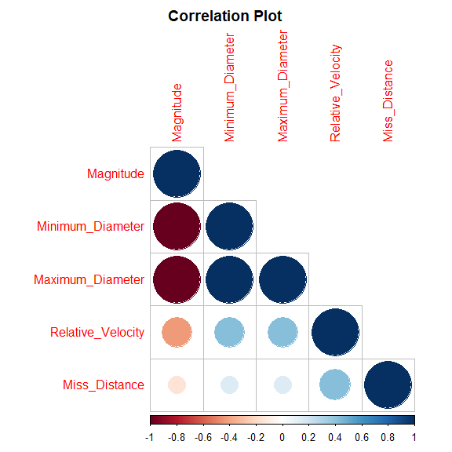
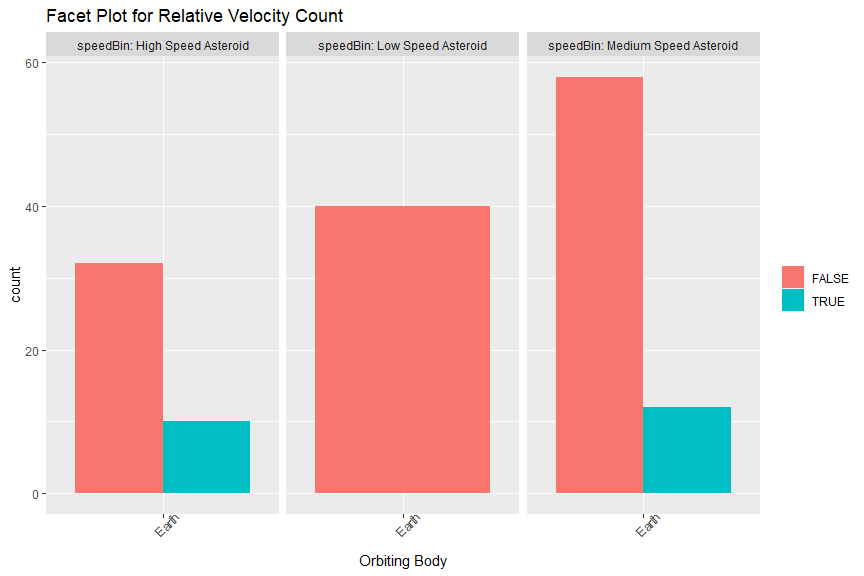
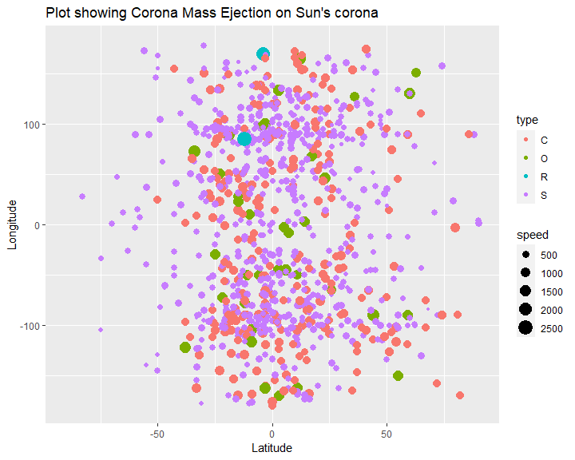
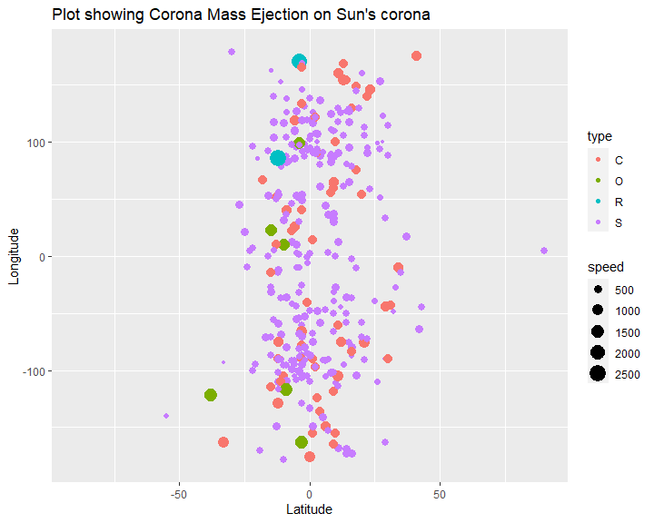
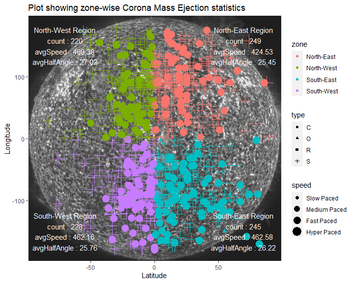
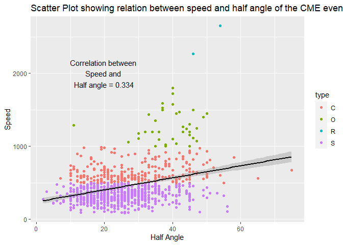
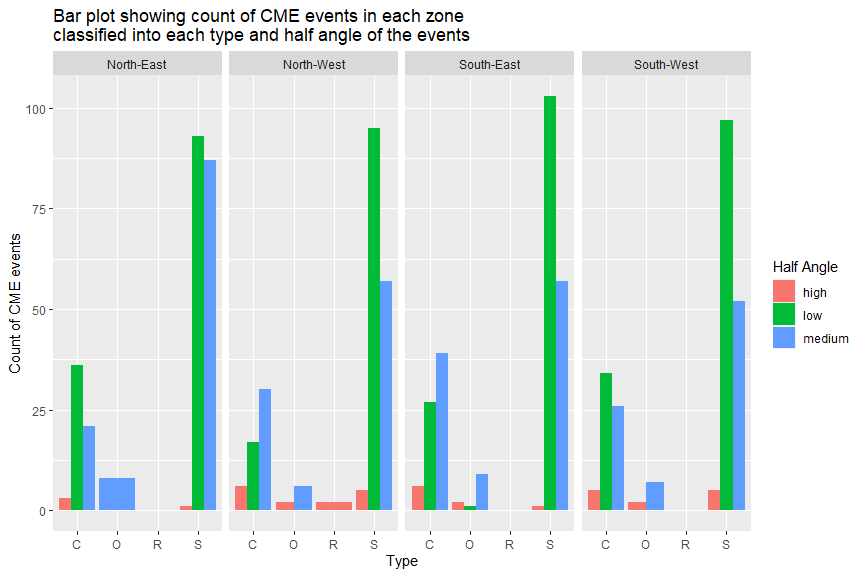
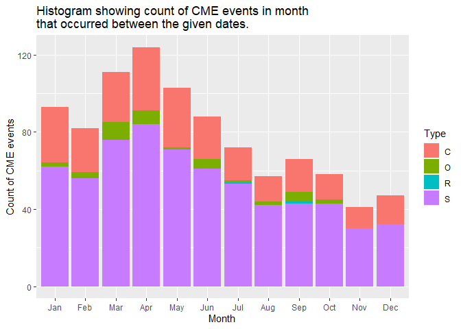
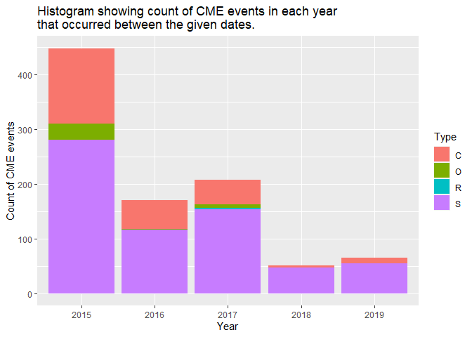

ST558 Project 2 - NASA APIs
================
Shyam Gadhwala & Kamlesh Pandey

-   <a href="#introduction" id="toc-introduction">Introduction</a>
-   <a href="#asteroid---neows" id="toc-asteroid---neows">Asteroid -
    NeoWs</a>
    -   <a href="#asteroid---neows-api" id="toc-asteroid---neows-api">Asteroid -
        NeoWs API</a>
    -   <a href="#helper-function-to-get-the-asteroid-neows-data"
        id="toc-helper-function-to-get-the-asteroid-neows-data">Helper function
        to get the Asteroid NeoWs data:</a>
-   <a href="#coronal-mass-ejection-cme-analysis"
    id="toc-coronal-mass-ejection-cme-analysis">Coronal Mass Ejection (CME)
    Analysis</a>
    -   <a href="#coronal-mass-ejection-cme-analysis-api"
        id="toc-coronal-mass-ejection-cme-analysis-api">Coronal Mass Ejection
        (CME) Analysis API:</a>
    -   <a href="#helper-function-to-get-the-cme-data"
        id="toc-helper-function-to-get-the-cme-data">Helper function to get the
        CME data:</a>
-   <a href="#parent-wrapper-function"
    id="toc-parent-wrapper-function">Parent Wrapper Function</a>
-   <a href="#exploratory-data-analysis-for-asteroid---neows-api-data"
    id="toc-exploratory-data-analysis-for-asteroid---neows-api-data">Exploratory
    Data Analysis for Asteroid - NeoWs API Data</a>
-   <a
    href="#exploratory-data-analysis-eda-of-coronal-mass-ejection-cme-analysis-api-data"
    id="toc-exploratory-data-analysis-eda-of-coronal-mass-ejection-cme-analysis-api-data">Exploratory
    Data Analysis (EDA) of Coronal Mass Ejection (CME) Analysis API
    Data.</a>
-   <a href="#ending-remarks" id="toc-ending-remarks">Ending Remarks</a>

# Introduction

This vignette is based on demonstrating how to interact with the NASA
APIs. Two of the NASA’s APIs have been used for this project, namely
Asteroid-NeoWs API and Coronal Mass Ejection Analysis API. The primary
purpose of the functions used in this vignette is to call an end point
of the API, download data from the API and explore visualization package
ggplot2 for exploratory data analysis of the fetched data to gain
valuable insights.

[NASA API Link](https://api.nasa.gov/index.html)

Few of the essential packages used for this project are:

[httr](https://httr.r-lib.org/)to provide a wrapper function and
customized to the demand of modern web APIs.
[jsonlite](https://cran.r-project.org/web/packages/jsonlite/vignettes/json-aaquickstart.html)
to provide flexibility in mapping json and R data
[lubridate](https://lubridate.tidyverse.org/)to manipulate date and time
[ggplot](https://ggplot2.tidyverse.org/)used for creating graphics
[tidyverse](https://www.tidyverse.org/)for data analysis purpose

``` r
library(httr)
library(tidyverse)
library(jsonlite)
library(dplyr)
library(ggplot2)
library(ggpubr)
library(jpeg)
library(lubridate)
library(GGally)
library(corrplot)
```

# Asteroid - NeoWs

NeoWs (Near Earth object Web Service) is a REST API for near earth
Asteroid information. Near Earth Objects (NEOs) are comets and asteroids
and due to the gravitational attraction of nearby planet they enter into
earth gravitational orbit

## Asteroid - NeoWs API

This API has near earth objects (NEO) tracking and the data set has 99%
asteroids and only 1% comet data.

This API offers the following modifications:

1.  Magnitude (H): Asteroid absolute magnitude is the visual magnitude a
    observer would record if asteroid is place 1AU away from the sun
2.  Close-Approach (CA) Date : Date (TBD) of closest Earth approach.
3.  V Relative : Object velocity relative to the earth
4.  Maximum_Diameter (miles): Estimated maximum diameter in miles
5.  Minimum_Diameter (miles): Estimated minimum diameter in miles

## Helper function to get the Asteroid NeoWs data:

This function will call the API with desired modification. This API has
start and end date as modifications. User can provide a date range for
the API and by GET request we can retrieve the data. The start and end
date are mandatory input without any default argument.  
This helper function has multiple checks for correct format for start
and end date. In case of correct input dates, the modification will be
added to the API and respective data is generated.

The data columns extracted from the APIs are as follow: 1. Magnitude  
2. Minimum Diameter(miles)  
3. Maximum Diameter(miles)  
4. Relative Velocity  
5. Approach Date  
6. Miss Distance (AU)  
7. Orbiting Body 2. IS Asteroid Potentially hazardous

``` r
asteroidData <- function(start_date, end_date, ...){
  baseURL <- 'https://api.nasa.gov/neo/rest/v1/'
  apiKey <- 'igUogzKaubKUi5TTgsbYcdVgU8pICrvizcCrCtY5'
  endpoint <- 'feed'
  url <- paste0(baseURL, endpoint, '?startDate=', start_date, '&endDate=', end_date,'&api_key=', apiKey)
  
  # GET request for API
  res <- GET(url)
  asteroidData <- fromJSON(rawToChar(res$content))
  
  # check for  correct date format
  dateFormat <- "%Y-%m-%d"
  
  # check if start and end dates are in correct format or not
  checkStart <- tryCatch(!is.na(as.Date(start_date, dateFormat)), 
             error = function(err) 
             {TRUE})
  checkEnd <- tryCatch(!is.na(as.Date(end_date, dateFormat)), 
             error = function(err) 
             {TRUE})
  
  # if eother the start or the end dates are not in correct format stop the program
  if (checkStart == FALSE | checkEnd == FALSE){
    message <- paste('[ERROR..!!] Either your start or end date is not is correct YYYY-MM-DD format')
    stop(message)
  }
  # if both start and end dates are in correct format 
  else if(checkStart == TRUE & checkEnd == TRUE){
    
    # check if end_date > start_date, if true stop the program
    if (ymd(end_date) < ymd(start_date)){
      message <- paste('End date' , end_date, 'should be greater than the start date', start_date)
      stop(message)
      
      } 
    # if dates are in correct format then execute the code
    else if (ymd(end_date) > ymd(start_date)){
        
        # check for the diff between the start and end date
        diffDate <- difftime(ymd(end_date), ymd(start_date), units = 'days')
        
        if (diffDate > 8){
          message <- paste('[WARNING..!!] The difference between the date range should be less than 8 days', 
                           'for this current date range the API will return future Approach date ')
        }
        
        # API Parameters      
        magnitude <- c()
        dMin  <- c()
        dMax <- c()
        velocity <- c()
        Date <- c()
        missDist <- c()
        orbitBody <- c()
        isHazard <- c()
          
        for (i in 1:length(asteroidData$near_earth_objects)) {
          absMag <- asteroidData$near_earth_objects[[i]]$absolute_magnitude_h
          dMin_  <- asteroidData$near_earth_objects[[i]]$estimated_diameter$miles$estimated_diameter_min
          dMax_ <- asteroidData$near_earth_objects[[i]]$estimated_diameter$miles$estimated_diameter_max
          isHazard_ <- asteroidData$near_earth_objects[[i]]$is_potentially_hazardous_asteroid
          
          tempDate <- c()
          tempVel <- c()
          tempDist <- c()
          tempOrbit <- c()
          
          # for close approach
          for (j in 1:length(asteroidData$near_earth_objects[[i]]$close_approach_data)){
            # approach velocity from the API
            vel <- asteroidData$near_earth_objects[[i]]$close_approach_data[[j]]$relative_velocity$kilometers_per_hour
            # storing in a temporary factor
            tempVel <- append(tempVel, vel)
            # getting date from the API
            date <- asteroidData$near_earth_objects[[i]]$close_approach_data[[j]]$close_approach_date
            # storing in a temporary factor
            tempDate <- append(tempDate, date)
            # miss distance from the API
            dist <- asteroidData$near_earth_objects[[i]]$close_approach_data[[j]]$miss_distance$astronomical
            # storing in a temporary factor
            tempDist <- append(tempDist, dist)
            # getting orbiting body from the API
            orbit <- asteroidData$near_earth_objects[[i]]$close_approach_data[[j]]$orbiting_body
            # storing in a temporary factor
            tempOrbit <- append(tempOrbit, orbit)
          }
          missDist <- append(missDist, as.numeric(tempDist))
          Date <- append(Date, tempDate)
          velocity <-append(velocity, as.numeric(tempVel))
          magnitude <- append(magnitude, absMag)
          dMin <- append(dMin, dMin_)
          dMax <- append(dMax, dMax_)
          orbitBody <- append(orbitBody, tempOrbit)
          isHazard <- append(isHazard, isHazard_)
          
  }
      }
  }
  #final tibble
  aesData <- tibble('Magnitude' = magnitude, 
                    'Minimum_Diameter' = dMin, 
                    'Maximum_Diameter' = dMax, 
                    'Relative_Velocity' = velocity,
                    'Approach_Date' = Date, 
                    'Miss_Distance' = missDist,
                    'Orbiting_Body' = orbitBody,
                    'Is_Potentially_Hazardous_Asteroid' = isHazard)

# This function will return the URL of the API and the data set generated
return (list(url = url, data = aesData))
}
```

# Coronal Mass Ejection (CME) Analysis

The sun of our solar system has multiple atmospheric layers. The inner
layers are the Core, Radiative Zone and Convection Zone. The outer
layers are the Photo sphere, the Chromosphere, the Transition Region and
the Corona. Coronal Mass Ejection (CME) phenomena is when there are huge
explosions of plasma and field from the sun’s corona layer. These
explosions typically have certain path and speed when they are emitted
in the heliosphere. Sometimes intense CMEs travel at speeds more than
3000 km/s. The radiation or the solar wind takes up to 17-18hours to
reach earth. Hence, to predict severe solar radiation, we need to see
the characteristics of the explosions, and find any correlations between
its properties.

## Coronal Mass Ejection (CME) Analysis API:

This api is a part of Space Weather Database of Notifications,
Knowledge, Information (DONKI) online tool for space weather related
APIs and data. As a part of DONKI, the following api has been released
by NASA that helps with the data of such CME events:

[Coronal Mass Ejection
(CME)](https://api.nasa.gov/index.html#donkiCMEAnalysis)

Some of the modifications offered in this API are:  
1. Start Date: Desired starting date from which the data wants to be
collected (default value is 30 days prior to current UTC time)  
2. End Date: Desired ending date till when the data wants to be
collected (default value is current UTC time  
3. Most Accurate Only (default set to True)  
4. Complete Entry Only (default set to True)  
5. Speed (lower limit): Speed of the coronal mass ejection event
(default set to 0)  
6. Half Angle (lower limit): the angle of the coronal mass ejection
event with respect to vertical axis (default set to 0)  
7. Catalog (default set to ALL)  
8. Keyword (default set to NONE)

In this vignette, we have focused on the main 4 modifications,  
1. Start Date  
2. End Date  
3. Speed  
4. Half Angle

## Helper function to get the CME data:

This is a helper function that will call the API endpoint according to
the modification values. This function takes the above mentioned 4
modifications as input; the start date, the end date, minimum speed, and
minimum half angle.

The start date and end date are mandatory for any user to enter, while
speed and half angle both have a default value of 0, so if the values
for speed or half angle are not specified, it will take 0 as the input.

To make the API function more rigid, I have implemented many checks that
includes the start and end date format check, speed and half angle
values and data type check, and throw warnings and errors accordingly.
If the input data is correct then the modification values are appended
to the base URL of the API, which is called and a JSON is returned as a
result which will have the details of the CME event between the two
dates having mentioned speed and half angle characteristics.

The data from the JSON extracted here are:  
1. time: Time of the CME event  
2. latitude: The latitude value of the coordinate where the CME event
took place  
3. longitude: The longitude value of the coordinate where the CME event
took place  
4. halfAngle: The half angle value of the trajectory of the explosion  
5. speed: The speed of the explosion  
6. type: Type of events (classifications include “C”, “O”, “R”, “S”)

A tibble is created with the above stated details and is returned from
the function along with the URL that was formed from the input values
for modifications.

``` r
cmeData <- function(startDate, endDate, speed = 0, halfAngle = 0, ...){
  baseUrl <- 'https://api.nasa.gov/DONKI/'
  apiKey <- 'igUogzKaubKUi5TTgsbYcdVgU8pICrvizcCrCtY5'
  
  # Start and End Dates data format check
  checkStart <- !is.na(parse_date_time(startDate, orders = "ymd"))
  if(!checkStart){
    errorMessage <- "Please enter the Start Date in the YYYY-mm-dd format and try again."
    stop(errorMessage)
  }
  
  checkEnd <- !is.na(parse_date_time(endDate, orders = "ymd"))
  if(!checkEnd){
    errorMessage <- "Please enter the End Date in the YYYY-mm-dd format and try again."
    stop(errorMessage)
  }
  
  if (as.Date(startDate) > as.Date(endDate)){
    errorMessage <- "The start date cannot be after the end date. Please enter the dates again."
    stop(errorMessage)
  }
  
  #Speed and Half Angle data type checks
  if (!is.numeric(speed)){
    errorMessage <- "Speed can only take numeric values. Please enter speed again."
    stop(errorMessage)
  }
  
  if (!is.numeric(halfAngle)){
    errorMessage <- "Half Angle can only take numeric values. Please enter half angle again."
    stop(errorMessage)
  }
  
  if (speed < 0){
    warning("Warning: ", "The speed cannot be negative. Proceeding with its default value of 0.")
    speed = 0
  }
  
  if (halfAngle < 0){
    warning("Warning: ", "The half angle cannot be negative. Proceeding with its default value of 0.")
    halfAngle = 0
  }
  
  #this part of the code combines the base URL with the modification(s) value(s) entered by the user
  #targetUrl is the final URL that is hit to get the data from API
  targetUrl <- paste0(baseUrl, "CMEAnalysis?", "startDate=", startDate, 
                      "&endDate=", endDate, "&speed=", speed,
                      "&halfAngle=", halfAngle, "&api_key=", apiKey)
  
  jsonContent <- fromJSON(rawToChar(GET(targetUrl)$content))
  
  #extracting useful info from the API data
  time <- jsonContent$time21_5
  lat <- jsonContent$latitude
  lon <- jsonContent$longitude
  halfAngle_ <- jsonContent$halfAngle
  speed_ <- jsonContent$speed
  type <- jsonContent$type
  
  cmeDataTibble <- tibble(time = time, latitude = lat, longitude = lon, halfAngle = halfAngle_,speed = speed_, type = type)

  
  return(list(url = targetUrl, data = cmeDataTibble))
}
```

# Parent Wrapper Function

The following the is the main parent wrapper function. This function
takes the following input:  
1. api: The API that the user is interested in calling (Coronal Mass
Ejection (CME) Analysis or Asteroids - NeoWs)

For this, the user can either give the abbreviated or the full name of
the api, either will lead to the same call of the designated API.

2.  …: This takes the additional input for particular APIs. For Coronal
    Mass Ejection (CME) Analysis API, it will read the start date, end
    date, speed and half angle. For Asteroids - NeoWs, it will read the
    start date and end date.

Note: If any API other than the above mentioned two is called, an error
message will be thrown stating that this API is not yet supported.

``` r
apiSelection <- function(api, ...){
  
  if (tolower(api) == tolower("Coronal Mass Ejection (CME) Analysis") | 
      tolower(api) == tolower("cme")){
    return(cmeData(...))
    
  }
  else if(tolower(api) == tolower("Asteroids - NeoWs")){
    return(asteroidData(...))
    
  }
  else{
    return("This api is not yet supported. Please select from either 'Coronal Mass Ejection (CME) Analysis' or 'Asteroid (AST)'.")
  }
}
```

# Exploratory Data Analysis for Asteroid - NeoWs API Data

Calling the API for Asteroid-NEOs from the wrapper function using sample
start and end date. Here I have selected start date as 2017-01-01, and
the end date as 2017-08-01.

When the API returns the data, the useful data is converted to a tibble
and is showed below. I have also called the summary function to get an
overview of numerical feature columns.

``` r
astDf <- apiSelection(api = "Asteroids - NeoWs", '2017-01-01', '2017-08-01')$data

summary(astDf %>% select(Magnitude:Miss_Distance))
```

    ##    Magnitude     Minimum_Diameter  
    ##  Min.   :16.76   Min.   :0.001896  
    ##  1st Qu.:20.62   1st Qu.:0.019429  
    ##  Median :22.15   Median :0.061379  
    ##  Mean   :22.65   Mean   :0.103730  
    ##  3rd Qu.:24.65   3rd Qu.:0.123998  
    ##  Max.   :29.70   Max.   :0.734355  
    ##  Maximum_Diameter  Relative_Velocity
    ##  Min.   :0.00424   Min.   :  7037   
    ##  1st Qu.:0.04344   1st Qu.: 35301   
    ##  Median :0.13725   Median : 49976   
    ##  Mean   :0.23195   Mean   : 52996   
    ##  3rd Qu.:0.27727   3rd Qu.: 67034   
    ##  Max.   :1.64207   Max.   :123714   
    ##  Approach_Date     
    ##  Length:76         
    ##  Class :character  
    ##  Mode  :character  
    ##                    
    ##                    
    ##                    
    ##  Miss_Distance     
    ##  Min.   :0.003582  
    ##  1st Qu.:0.186202  
    ##  Median :0.291632  
    ##  Mean   :0.283531  
    ##  3rd Qu.:0.386678  
    ##  Max.   :0.498633

``` r
# EDA on Asteroid data

plot1 <- ggplot(astDf, aes(x = Approach_Date, y = Miss_Distance))

plot1 + geom_point(aes(color = Is_Potentially_Hazardous_Asteroid, size = Maximum_Diameter), alpha = 0.7) +
  theme(axis.text.x = element_text(angle = 45), axis.text.y = element_blank())+
  theme(axis.text.y = element_blank(), 
        axis.ticks.y = element_blank()) +
  labs(title = 'Point Plot',
      subtitle = "Miss Distance For Date Range")
```

<!-- --> In the
scatter plot, I have tried to visualize the count for Miss Distance for
a give n date range with diameter as a size and if that particular
asteroid is hazardous or not. Few key finding from the plots:  
1. Most of the asteroids are categorized as a non hazardous for a given
date range  
2. All bigger asteroid (large diameter) are in upper part of the plot

``` r
# boxplot for min and max diamter

par(mfrow = c(1,2))
plot2 <- ggplot(astDf, aes(x = Is_Potentially_Hazardous_Asteroid,  y = Minimum_Diameter))

plot2 + 
  geom_boxplot() + geom_point(aes(color = Is_Potentially_Hazardous_Asteroid), position = 'jitter') + 
  labs('Box Plot for Minimum Diameter') + 
  xlab('If Asteroid Hazardous ') + 
  ylab('Minimum Diamter') + 
  labs(title = "Box Plot",
       subtitle = "Minimum Diamter Variation Across Asteroid Type ")
```

<!-- -->

The dark line in box plot represent the median and the top box is 75
%ile and bottom box is 25 %ile. The end points of the black line are
whiskers and they are at a distance of 1.5\*IQR. In this plot we can
visualize that the median diameter of potentially hazardous asteroid is
higher than the non hazardous asteroid. From the plot, we can also
visualize few extreme points (\>1.5IQR).

``` r
numericalDf <- astDf[, c(1,2,3,4,6)]

corr <- cor(numericalDf, method = "spearman")

# Plot
corrplot(corr, hc.order = TRUE, 
           type = "lower", 
           tl.pos = "lt",
         title = "Correlation Plot",
         subtitle = "Correlation Coefficient for Asteroid Data",
         mar=c(0,0,2,0)
         )
```

<!-- -->

Correlation plot gives the relation among parameters, i.e is there any
increase or decrease in a parameter directly affecting other parameter.
From this correlation plot of asteroid data we can estimate that almost
all parameters have a weak positive correlation coefficient.Magnitude
and Relative velocity has a strong negative correlation coefficient,
which needs to be taken care (adding interaction terms) in a model
building.

``` r
# creating a new factor for relative speed
speedClassfication <- c("Low Speed Asteroid", "Medium Speed Asteroid", "High Speed Asteroid" )
astDf <- astDf %>%
  mutate(speedBin = factor(if_else(Relative_Velocity<37000, speedClassfication[1],
                                   if_else(Relative_Velocity<66000, speedClassfication[2],
                           speedClassfication[3]))))
# plot
plot3 <- ggplot(astDf, aes(x = Orbiting_Body, fill = Is_Potentially_Hazardous_Asteroid))

plot3 + geom_bar(stat = 'count', position = position_dodge()) +
        facet_grid(cols = vars(speedBin), 
                   labeller = label_both) +                          # 
                    theme(axis.text.x = element_text(angle = 45), 
                          legend.title = element_blank()) +
        xlab('Orbiting Body') +
        labs(title = "Facet Plot for Relative Velocity Count ")
```

<!-- -->

# Exploratory Data Analysis (EDA) of Coronal Mass Ejection (CME) Analysis API Data.

Calling the API for CME from the wrapper function using some sample
start and end date. Here I have selected start date as 2017-01-01, and
the end date as 2020-01-01. The speed and half angle are kept as default
that is 0.

When the API returns the data, the useful data is converted to a tibble
and is showed below. I have also called the summary function to get an
overview of the data.

``` r
cmeSampleData <- apiSelection("Coronal Mass Ejection (CME) Analysis", "2017-01-01", "2020-01-01")$data

print(cmeSampleData)
```

    ## # A tibble: 324 x 6
    ##    time  latit~1 longi~2 halfA~3 speed
    ##    <chr>   <dbl>   <dbl>   <dbl> <dbl>
    ##  1 2017~     -10    -105      20   645
    ##  2 2017~     -33     -93      26    88
    ##  3 2017~       3     100      22   167
    ##  4 2017~       1     -90      36   580
    ##  5 2017~      10    -155      10   628
    ##  6 2017~      11      90      15   365
    ##  7 2017~       0     -48      14   353
    ##  8 2017~      11     160      11   723
    ##  9 2017~      16     -80      21   429
    ## 10 2017~      21     105      26   276
    ## # ... with 314 more rows, 1 more
    ## #   variable: type <chr>, and
    ## #   abbreviated variable names
    ## #   1: latitude, 2: longitude,
    ## #   3: halfAngle

``` r
summary(cmeSampleData %>% select(halfAngle, speed, latitude, longitude))
```

    ##    halfAngle         speed       
    ##  Min.   : 2.00   Min.   :  88.0  
    ##  1st Qu.:16.00   1st Qu.: 281.5  
    ##  Median :22.00   Median : 359.0  
    ##  Mean   :22.27   Mean   : 413.9  
    ##  3rd Qu.:27.00   3rd Qu.: 459.0  
    ##  Max.   :54.00   Max.   :2650.0  
    ##     latitude         longitude     
    ##  Min.   :-55.000   Min.   :-178.0  
    ##  1st Qu.: -7.000   1st Qu.: -88.0  
    ##  Median :  0.000   Median :   1.5  
    ##  Mean   :  2.506   Mean   :   2.5  
    ##  3rd Qu.: 11.000   3rd Qu.:  92.0  
    ##  Max.   : 90.000   Max.   : 178.0

To start with the initial EDA, using ggplot2 library, I have made a
scatter plot representing the latitude and longitude of each of the CME
events taking place on sun’s atmosphere. The different colored dots
represent the different event types, while the size of the dots
represent the speed of explosion. the smaller the dot, the lesser the
speed of the event and vice versa.

``` r
img <- readJPEG("img\\sun2.jpeg")

cmeSampleData$type <- as.factor(cmeSampleData$type)

show(ggplot(cmeSampleData, aes(x=latitude, y=longitude)) +
    geom_point(aes(color = type, size = speed)) +
    ylim(-180,180) +
    xlim(-90, 90)  +
  labs(title="Plot showing Corona Mass Ejection on Sun's corona",
        x ="Latitude", y = "Longitude"))
```

<!-- -->

To see it more in respect to the actual sun’s corona layer, I have
imported an image of sun and use it as a background to give a better
perspective of where the events took place. (the sun’s corona layer to
CME events is not to scale, and is only for representational purposes).

``` r
ggplot(cmeSampleData, aes(x=latitude, y=longitude)) +
    background_image(img) +
    geom_point(aes(color = type, size = speed)) +
    ylim(-180,180) +
    xlim(-90, 90)  +
  labs(title="Plot showing Corona Mass Ejection on Sun's corona",
        x ="Latitude", y = "Longitude")
```

<!-- -->

To gain more insights about the data, I have segregated the speed,
location, and half angle from the data.  
1. The speed has 4 classifications; Slow Paced, Medium Paced, Fast Paced
and Hyper Paced.  
2. Location is divided into 4 zones based on their latitude and
longitude; North-East, North-West, South-East and South-West.  
3. Half Angles are classified into 3 categories; low, medium and high

After adding these classified variables, I am again printing the data.

``` r
cmeSampleData$type <- as.factor(cmeSampleData$type)

speedClassfication <- c("Slow Paced", "Medium Paced", "Fast Paced", "Hyper Paced")

cmeSampleData <- cmeSampleData %>% 
  mutate(speedC = as.factor(if_else(speed < 500, speedClassfication[1],
                                            if_else(speed < 1000,  speedClassfication[2],
                                                    if_else(speed < 2000, speedClassfication[3], speedClassfication[4])))))


zones <- c("North-East", "North-West", "South-East", "South-West")
cmeSampleData <- cmeSampleData %>%
  mutate(zone = as.factor(if_else(latitude>=0 & longitude>=0, zones[1],
                        if_else(latitude<=0 & longitude>=0,zones[2],
                                if_else(latitude<=0 & longitude<=0, zones[4],
                                        if_else(latitude>=0 & longitude<=0, zones[3], "Error"))))))

angles <- c("low", "medium", "high")
cmeSampleData <- cmeSampleData %>% 
  mutate(halfAngleC = as.factor(if_else(halfAngle <= 25, angles[1],
                                            if_else(halfAngle <= 45,  angles[2],
                                                     angles[3]))))

cmeSampleData
```

    ## # A tibble: 324 x 9
    ##    time  latit~1 longi~2 halfA~3 speed
    ##    <chr>   <dbl>   <dbl>   <dbl> <dbl>
    ##  1 2017~     -10    -105      20   645
    ##  2 2017~     -33     -93      26    88
    ##  3 2017~       3     100      22   167
    ##  4 2017~       1     -90      36   580
    ##  5 2017~      10    -155      10   628
    ##  6 2017~      11      90      15   365
    ##  7 2017~       0     -48      14   353
    ##  8 2017~      11     160      11   723
    ##  9 2017~      16     -80      21   429
    ## 10 2017~      21     105      26   276
    ## # ... with 314 more rows, 4 more
    ## #   variables: type <fct>,
    ## #   speedC <fct>, zone <fct>,
    ## #   halfAngleC <fct>, and abbreviated
    ## #   variable names 1: latitude,
    ## #   2: longitude, 3: halfAngle

Then from the data, I have grouped the data by combining zone, speed and
type of event, and for each group, I have calculated the number of
events, average Speed, Standard deviation of speed, average half angle
and standard deviation of half angle.

``` r
cmeSampleData %>%
  group_by(zone, speedC, type) %>%
  summarize(avgSpeed = mean(speed), sdSpeed = sd(speed),
            avgHalfAngle = mean(halfAngle), 
            sdHalfAngle = sd(halfAngle), count = n()) %>% arrange(zone, speedC)
```

    ## # A tibble: 11 x 8
    ## # Groups:   zone, speedC [11]
    ##    zone   speedC type  avgSp~1 sdSpeed
    ##    <fct>  <fct>  <fct>   <dbl>   <dbl>
    ##  1 North~ Mediu~ C        627.   100. 
    ##  2 North~ Slow ~ S        325.    88.3
    ##  3 North~ Fast ~ O       1177.    62.0
    ##  4 North~ Hyper~ R       2460.   268. 
    ##  5 North~ Mediu~ C        620.    82.6
    ##  6 North~ Slow ~ S        326.    95.1
    ##  7 South~ Mediu~ C        634.   126. 
    ##  8 South~ Slow ~ S        313.    90.5
    ##  9 South~ Fast ~ O       1437     32.0
    ## 10 South~ Mediu~ C        691.   173. 
    ## 11 South~ Slow ~ S        328.    81.7
    ## # ... with 3 more variables:
    ## #   avgHalfAngle <dbl>,
    ## #   sdHalfAngle <dbl>, count <int>,
    ## #   and abbreviated variable name
    ## #   1: avgSpeed

Then contingency table is created for zone, speed and type of events,
and is showed below.

``` r
print(table(cmeSampleData$zone, cmeSampleData$speedC, cmeSampleData$type))
```

    ## , ,  = C
    ## 
    ##             
    ##              Fast Paced Hyper Paced
    ##   North-East          0           0
    ##   North-West          0           0
    ##   South-East          0           0
    ##   South-West          0           0
    ##             
    ##              Medium Paced Slow Paced
    ##   North-East           19          0
    ##   North-West           10          0
    ##   South-East           18          0
    ##   South-West           13          0
    ## 
    ## , ,  = O
    ## 
    ##             
    ##              Fast Paced Hyper Paced
    ##   North-East          0           0
    ##   North-West          3           0
    ##   South-East          0           0
    ##   South-West          3           0
    ##             
    ##              Medium Paced Slow Paced
    ##   North-East            0          0
    ##   North-West            0          0
    ##   South-East            0          0
    ##   South-West            0          0
    ## 
    ## , ,  = R
    ## 
    ##             
    ##              Fast Paced Hyper Paced
    ##   North-East          0           0
    ##   North-West          0           2
    ##   South-East          0           0
    ##   South-West          0           0
    ##             
    ##              Medium Paced Slow Paced
    ##   North-East            0          0
    ##   North-West            0          0
    ##   South-East            0          0
    ##   South-West            0          0
    ## 
    ## , ,  = S
    ## 
    ##             
    ##              Fast Paced Hyper Paced
    ##   North-East          0           0
    ##   North-West          0           0
    ##   South-East          0           0
    ##   South-West          0           0
    ##             
    ##              Medium Paced Slow Paced
    ##   North-East            0         75
    ##   North-West            0         56
    ##   South-East            0         54
    ##   South-West            0         71

A simpler contingency table between the count of CME events per zone per
speed category is as shown:

``` r
print(knitr::kable(table(cmeSampleData$zone, cmeSampleData$speedC)))
```

    ## 
    ## 
    ## |           | Fast Paced| Hyper Paced| Medium Paced| Slow Paced|
    ## |:----------|----------:|-----------:|------------:|----------:|
    ## |North-East |          0|           0|           19|         75|
    ## |North-West |          3|           2|           10|         56|
    ## |South-East |          0|           0|           18|         54|
    ## |South-West |          3|           0|           13|         71|

To further see the statistics about the CME events in each zone, I have
plotted the following The 4 different colors represent 4 different
zones, the shape of each event represents the type of the event, and the
size of each events represents the speed of ejection during the CME
event (Sun’s surface to event locations is not to scale and is only for
representation purposes).

``` r
#img <- readJPEG("img\\sun2.jpeg")

ggplot(cmeSampleData, aes(x=latitude, y=longitude)) +
    background_image(img) +
    geom_point(aes(color = zone, size = speedC, shape = type)) +
    #scale_shape_discrete(name = "Type", labels = c("S", "C")) +
    #scale_color_manual(values = c("C" = "#37a0bf", "S" = "green")) +
    scale_size_discrete(name = "speed", labels = c(speedClassfication[1], speedClassfication[2], speedClassfication[3], speedClassfication[4])) + 
    ylim(-180,180) +
    xlim(-90, 90) +
  
    annotate(geom="text", x=70, y=150, label=paste0("North-East Region\ncount : ", nrow(cmeSampleData %>% filter(zone==zones[1])), "\navgSpeed : ", round(mean((cmeSampleData %>% filter(zone == zones[1]))$speed), 2),
                                                  "\navgHalfAngle : ", round(mean((cmeSampleData %>% filter(zone == zones[1]))$halfAngle), 2)),
              color="White", size=4) + 
  
  annotate(geom="text", x=-70, y=150, label=paste0("North-West Region\ncount : ", nrow(cmeSampleData %>% filter(zone==zones[2])), "\navgSpeed : ", round(mean((cmeSampleData %>% filter(zone == zones[2]))$speed), 2),
                                                  "\navgHalfAngle : ", round(mean((cmeSampleData %>% filter(zone == zones[2]))$halfAngle), 2)),
              color="White", size=4) + 
  
  annotate(geom="text", x=-70, y=-150, label=paste0("South-West Region\ncount : ", nrow(cmeSampleData %>% filter(zone==zones[4])), "\navgSpeed : ", round(mean((cmeSampleData %>% filter(zone == zones[4]))$speed), 2),
                                                  "\navgHalfAngle : ", round(mean((cmeSampleData %>% filter(zone == zones[4]))$halfAngle), 2)),
              color="White", size=4) + 
  
  annotate(geom="text", x=70, y=-150, label=paste0("South-East Region\ncount : ", nrow(cmeSampleData %>% filter(zone==zones[3])), "\navgSpeed : ", round(mean((cmeSampleData %>% filter(zone == zones[3]))$speed), 2),
                                                  "\navgHalfAngle : ", round(mean((cmeSampleData %>% filter(zone == zones[3]))$halfAngle), 2)),
              color="White", size=4) +
  labs(title="Plot showing zone-wise Corona Mass Ejection statistics",
        x ="Latitude", y = "Longitude")
```

<!-- -->

A scatter plot between speed and half angle is also shown to visualize
correlation between the two variables. A linear model regression line is
also fitted with the help of geom_smooth function.

``` r
cor <- cor(cmeSampleData$halfAngle, cmeSampleData$speed)

ggplot(cmeSampleData, aes(x=halfAngle, y=speed)) +
  geom_point(aes(color = type)) + 
  geom_smooth(method = "lm",color="black") + 
  labs(title="Scatter Plot showing relation between speed and half angle of the CME event",
        x ="Half Angle", y = "Speed") + 
  annotate(geom="text", x=10, y=2000, label=paste0("Correlation between \nSpeed and Half angle = ", round(cor, 3)))
```

<!-- -->

Then for each zone, I have plotted the bar plots representing count of
CME events that are classified by their half angle values.

``` r
ggplot(cmeSampleData, aes(x = type)) + 
  geom_bar(aes(fill = halfAngleC), position = "dodge") + 
  scale_fill_discrete(name = "Half Angle") + 
  facet_grid(. ~ zone) + 
  labs(title="Bar plot showing count of CME events in each zone \nclassified into each type and half angle of the events ",
        x ="Type", y = "Count of CME events")
```

<!-- -->

Lastly, I took the dates (time-stamp) of events, and extracted months
and years from them, and plotted histograms for the count of CME events
occurring in each month, and each year between the given input start and
end dates, classified into the type of events on the histograms bins.

``` r
dates = c()
for (i in 1:nrow(cmeSampleData)){
  dates <- append(dates, strsplit(cmeSampleData$time[i], split="T")[[1]][1])
}
cmeSampleData$date <- dates

months = c()
for (i in 1:nrow(cmeSampleData)){
  months <- append(months, strsplit(cmeSampleData$date[i], split="-")[[1]][2])
}

years = c()
for (i in 1:nrow(cmeSampleData)){
  years <- append(years, strsplit(cmeSampleData$date[i], split="-")[[1]][1])
}

cmeSampleData$numyear <- as.numeric(years)
cmeSampleData$numyear <- as.factor(cmeSampleData$numyear)

cmeSampleData$nummonth <- as.numeric(months)
allmonths <- c("Jan","Feb","Mar",
              "Apr","May","Jun",
              "Jul","Aug","Sep",
              "Oct","Nov","Dec")
cmeSampleData$month <- allmonths[cmeSampleData$nummonth]
cmeSampleData$month <- as.factor(cmeSampleData$month)

cmeSampleData$month <- factor(cmeSampleData$month, ordered = TRUE, levels = c("Jan","Feb","Mar",
              "Apr","May","Jun",
              "Jul","Aug","Sep",
              "Oct","Nov","Dec"))

ggplot(cmeSampleData %>% group_by(month) %>% mutate(count = n()), aes(x=month))+
  geom_histogram(aes(fill=type), stat="count") + 
  scale_fill_discrete(name = "Type") + 
  labs(title="Histogram showing count of CME events in month \nthat occurred between the given dates.",
        x ="Month", y = "Count of CME events")
```

<!-- -->

``` r
ggplot(cmeSampleData %>% group_by(numyear) %>% mutate(count = n()), aes(x=numyear))+
  geom_histogram(aes(fill=type), stat="count") + 
  scale_fill_discrete(name = "Type") + 
  labs(title="Histogram showing count of CME events in each year \nthat occurred between the given dates.",
        x ="Year", y = "Count of CME events")
```

<!-- -->

# Ending Remarks

To summarize this vignette, we have built a wrapper function that would
take the API of user’s choice as input. Further two helper functions are
also created to support the called API. Coronal Mass Ejection (CME)
Analysis helps get the data of coronal mass ejection events between two
date ranges, and will have characteristics of the speed and half angle
as defined by the user. In similar fashion asteroid API helps in
retrieving data pertaining to near earth objects like asteroid and
comets. Following up on the date retrieved after the API call, we have
done the Exploratory Data Analysis to get some hidden and valuable
insights from the data.

Hope the functions build for this vignette helps for the NASA APIs!
