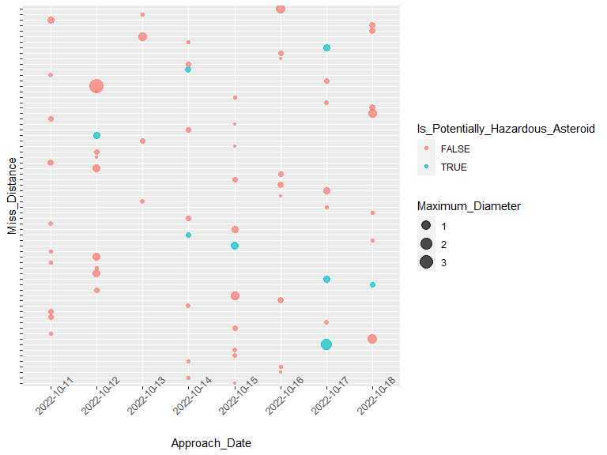
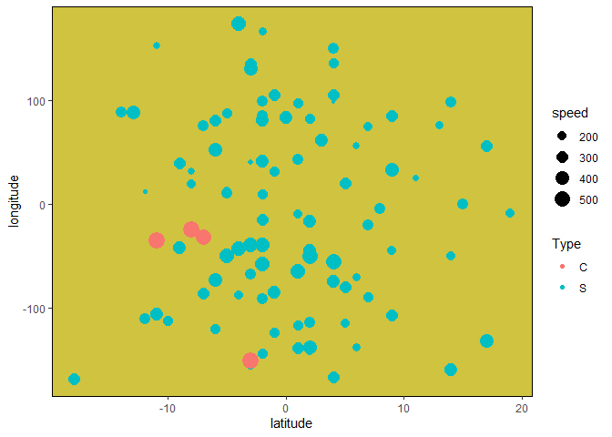
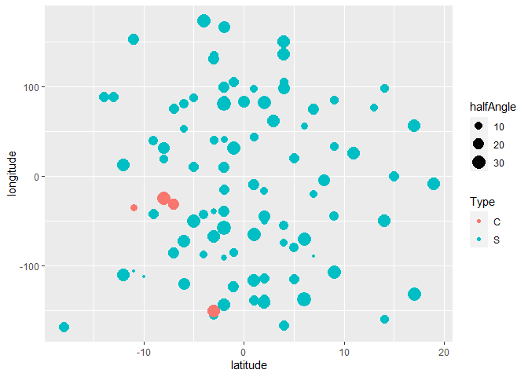

ST558 Project 2
================
Shyam Gadhwala & Kamlesh Pandey

``` r
library(httr)
library(tidyverse)
library(jsonlite)
library(dplyr)
library(ggplot2)
library(lubridate)
```

# Asteroid - NeoWs API

NeoWs (Near Earth object Web Service) is a REST API for near earth
Asteroid information. Near Earth Objects (NEOs) are comets and asteroids
and due to the gravitational attraction of nearby planet they enter into
earth gravitational orbit

This API has near earth objects (NEO) tracking and the data set has 99%
asteroids and only 1% comet data.

Parameter information:

Magnitude (H): Asteroid absolute magnitude (in general, smaller H
implies larger asteroid diameter). This parameter is undefined for
comets.

Close-Approach (CA) Date : Date (TBD) of closest Earth approach.

V Relative : Object velocity relative to the earth

``` r
asteroidData <- function(start_date, end_date, ...){
  baseURL <- 'https://api.nasa.gov/neo/rest/v1/'
  apiKey <- 'igUogzKaubKUi5TTgsbYcdVgU8pICrvizcCrCtY5'
  endpoint <- 'feed'
  url <- paste0(baseURL, endpoint, '?startDate=', start_date, '&endDate=', end_date,'&api_key=', apiKey)
  
  res <- GET(url)
  asteroidData <- fromJSON(rawToChar(res$content))
  
  # check for date format
  dateFormat <- "%Y-%m-%d"
  
  checkStart <- tryCatch(!is.na(as.Date(start_date, dateFormat)), 
             error = function(err) 
             {TRUE})
  
  checkEnd <- tryCatch(!is.na(as.Date(end_date, dateFormat)), 
             error = function(err) 
             {TRUE})
  
  # First Check for date format
  if (checkStart == FALSE | checkEnd == FALSE){
    message <- paste('[ERROR..!!] Either your start or end date is not is correct YYYY-MM-DD format')
    print(message)
    stop(message)
  }
  else if(checkStart == TRUE & checkEnd == TRUE){
    #check if end_date > start_date
    if (ymd(end_date) < ymd(start_date)){
      message <- paste('End date' , end_date, 'should be greater than the start date', start_date)
      print(message)
      stop(message())
      
      } else if (ymd(end_date) > ymd(start_date)){
        
        # check for the diff between the start and end date
        diffDate <- difftime(ymd(end_date), ymd(start_date), units = 'days')
        
        if (diffDate > 8){
          message <- paste('[WARNING..!!] The difference between the date range should be less than 8 days', 
                           'for this current date range the API will return future Approach date ')
          print(message)
        }
        
  # API Parameters      
        magnitude <- c()
        dMin  <- c()
        dMax <- c()
        velocity <- c()
        Date <- c()
        missDist <- c()
        orbitBody <- c()
        isHazard <- c()
          
        for (i in 1:length(asteroidData$near_earth_objects)) {
          absMag <- asteroidData$near_earth_objects[[i]]$absolute_magnitude_h
          dMin_  <- asteroidData$near_earth_objects[[i]]$estimated_diameter$miles$estimated_diameter_min
          dMax_ <- asteroidData$near_earth_objects[[i]]$estimated_diameter$miles$estimated_diameter_max
          isHazard_ <- asteroidData$near_earth_objects[[i]]$is_potentially_hazardous_asteroid
          
          tempDate <- c()
          tempVel <- c()
          tempDist <- c()
          tempOrbit <- c()
          
          # for close approach
          for (j in 1:length(asteroidData$near_earth_objects[[i]]$close_approach_data)){
            vel <- asteroidData$near_earth_objects[[i]]$close_approach_data[[j]]$relative_velocity$kilometers_per_hour
            tempVel <- append(tempVel, vel)
            date <- asteroidData$near_earth_objects[[i]]$close_approach_data[[j]]$close_approach_date
            tempDate <- append(tempDate, date)
            dist <- asteroidData$near_earth_objects[[i]]$close_approach_data[[j]]$miss_distance$astronomical
            tempDist <- append(tempDist, dist)
            orbit <- asteroidData$near_earth_objects[[i]]$close_approach_data[[j]]$orbiting_body
            tempOrbit <- append(tempOrbit, orbit)
            
          }
          
          missDist <- append(missDist, tempDist)
          Date <- append(Date, tempDate)
          velocity <-append(velocity, tempVel)
          magnitude <- append(magnitude, absMag)
          dMin <- append(dMin, dMin_)
          dMax <- append(dMax, dMax_)
          orbitBody <- append(orbitBody, tempOrbit)
          isHazard <- append(isHazard, isHazard_)
          
  }
  
      }
  }
  aesData <- tibble('Magnitude' = magnitude, 
                    'Minimum_Diameter' = dMin, 
                    'Maximum_Diameter' = dMax, 
                    'Relative_Velocity' = velocity,
                    'Approach_Date' = Date, 
                    'Miss_Distance' = missDist,
                    'Orbiting_Body' = orbitBody,
                    'Is_Potentially_Hazardous_Asteroid' = isHazard)
  
return (list(url = url, data = aesData))
  
}

data <- asteroidData('1994-10-10', '1994-12-10')$data
```

    ## [1] "[WARNING..!!] The difference between the date range should be less than 8 days for this current date range the API will return future Approach date "

``` r
# EDA on Asteroid data

asteroidData <- data

asteroidData
```

    ## # A tibble: 71 × 8
    ##    Magnitude Minimum_Diameter Maximum_…¹ Relat…² Appro…³ Miss_…⁴ Orbit…⁵ Is_Po…⁶
    ##        <dbl>            <dbl>      <dbl> <chr>   <chr>   <chr>   <chr>   <lgl>  
    ##  1      20.6           0.125      0.280  58294.… 2022-1… 0.4274… Earth   TRUE   
    ##  2      22.1           0.0628     0.140  104578… 2022-1… 0.3748… Earth   FALSE  
    ##  3      21.1           0.0995     0.223  85022.… 2022-1… 0.4388… Earth   FALSE  
    ##  4      24.5           0.0208     0.0465 43495.… 2022-1… 0.0157… Earth   FALSE  
    ##  5      21             0.104      0.233  67428.… 2022-1… 0.2604… Earth   TRUE   
    ##  6      21.2           0.0950     0.213  7036.8… 2022-1… 0.2865… Earth   FALSE  
    ##  7      24.2           0.0234     0.0524 68965.… 2022-1… 0.4814… Earth   FALSE  
    ##  8      23             0.0415     0.0928 43343.… 2022-1… 0.1438… Earth   FALSE  
    ##  9      25.2           0.0148     0.0331 31072.… 2022-1… 0.0714… Earth   FALSE  
    ## 10      19.6           0.199      0.444  39910.… 2022-1… 0.2696… Earth   FALSE  
    ## # … with 61 more rows, and abbreviated variable names ¹​Maximum_Diameter,
    ## #   ²​Relative_Velocity, ³​Approach_Date, ⁴​Miss_Distance, ⁵​Orbiting_Body,
    ## #   ⁶​Is_Potentially_Hazardous_Asteroid

``` r
# First round up to two values 


plot1 <- ggplot(asteroidData, aes(x = Approach_Date, y = Miss_Distance))

plot1 + geom_point(aes(color = Is_Potentially_Hazardous_Asteroid, size = Maximum_Diameter), alpha = 0.7) +
  theme(axis.text.x = element_text(angle = 45), axis.text.y = element_blank())
```

<!-- -->

``` r
cmeData <- function(startDate, endDate, speed = 0, halfAngle = 0, ...){
  baseUrl <- 'https://api.nasa.gov/DONKI/'
  apiKey <- 'igUogzKaubKUi5TTgsbYcdVgU8pICrvizcCrCtY5'
  
  checkStart <- !is.na(parse_date_time(startDate, orders = "ymd"))
  if(!checkStart){
    errorMessage <- "Please enter the Start Date in the YYYY-mm-dd format and try again."
    stop(errorMessage)
  }
  
  checkEnd <- !is.na(parse_date_time(endDate, orders = "ymd"))
  if(!checkEnd){
    errorMessage <- "Please enter the End Date in the YYYY-mm-dd format and try again."
    stop(errorMessage)
  }
  
  if (as.Date(startDate) > as.Date(endDate)){
    errorMessage <- "The start date cannot be after the end date. Please enter the dates again."
    stop(errorMessage)
  }
  
  if (speed < 0){
    paste0("Warning: ", "The speed cannot be negative. Proceeding with its default value of 0.")
    speed = 0
  }
  
  if (halfAngle < 0){
    paste0("Warning: ", "The half angle cannot be negative. Proceeding with its default value of 0.")
    halfAngle = 0
  }
  
  targetUrl <- paste0(baseUrl, "CMEAnalysis?", "startDate=", startDate, 
                      "&endDate=", endDate, "&speed=", speed,
                      "&halfAngle=", halfAngle, "&api_key=", apiKey)
  
  jsonContent <- fromJSON(rawToChar(GET(targetUrl)$content))
  
  time <- jsonContent$time21_5
  lat <- jsonContent$latitude
  lon <- jsonContent$longitude
  halfAngle_ <- jsonContent$halfAngle
  speed_ <- jsonContent$speed
  type <- jsonContent$type
  
  cmeDataTibble <- tibble(time = time, latitude = lat, longitude = lon, halfAngle = halfAngle_,speed = speed_, type = type)

  
  return(list(url = targetUrl, data = cmeDataTibble))
}
```

``` r
cmeSampleData <- cmeData("2019-11-10", "2020-11-10")$data

ggplot(cmeSampleData, aes(x=latitude, y=longitude)) +
  geom_point(aes(color = as.factor(type), size = speed)) +
  scale_color_discrete(name = "Type") +
  theme_classic() +
  theme(panel.background = element_rect(fill = '#cfc340', colour = '#000000'))
```

<!-- -->

``` r
ggplot(cmeSampleData, aes(x=latitude, y=longitude)) +
  geom_point(aes(color = as.factor(type), size = halfAngle)) +
  scale_color_discrete(name = "Type")
```

<!-- -->

``` r
apiSelection <- function(api, ...){
  
  if (tolower(api) == tolower("Coronal Mass Ejection (CME) Analysis")){
    cmeData(...)
    
  }
  else if(tolower(api) == tolower("Asteroids - NeoWs")){
    asteroidData(...)
    
  }
  else{
    return("This api is not yet supported. Please select from either 'Coronal Mass Ejection (CME) Analysis' or 'Asteroid (AST)'.")
  }
}
```
